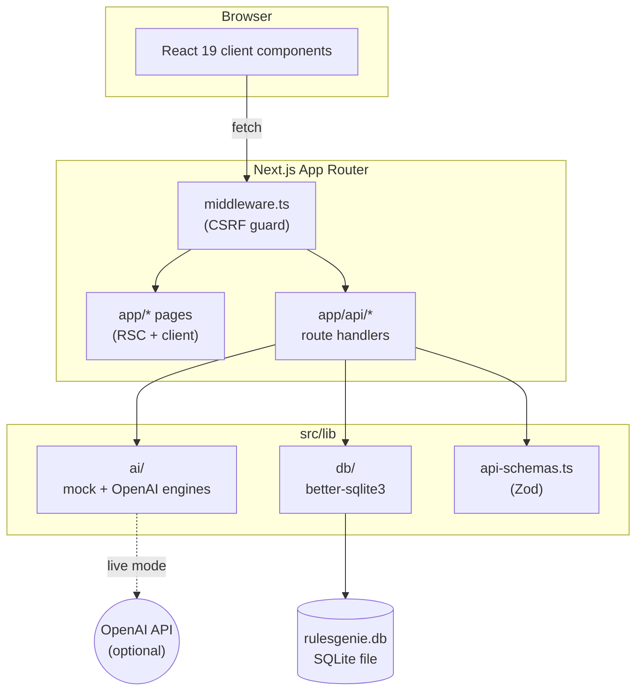

# Architecture

RulesGenie is a single Next.js 15 app with a sharp internal split
between **routes**, **the AI engine**, and **the database**. There are
no external services in the default configuration.

## High-level diagram



## Module responsibilities

| Module | Responsibility |
|---|---|
| `src/app/` | Next.js App Router pages and API routes. Pages are Server Components by default; client components opt in with `'use client'`. |
| `src/middleware.ts` | CSRF protection — all non-`GET` requests require a same-origin `Origin` or `Referer` header. |
| `src/lib/ai/` | The engine abstraction. `index.ts` chooses mock vs OpenAI; `mock-engine.ts` does keyword scoring; `openai-engine.ts` calls GPT-4o-mini. |
| `src/lib/db/` | All SQLite access. `connection.ts` opens the DB, `schema.ts` creates tables, `seed.ts` seeds dev data, `games.ts` / `sessions.ts` / `dashboard.ts` are query modules. |
| `src/lib/api-schemas.ts` | Zod schemas reused across server and client to validate every request and response shape. |
| `src/data/` | Static catalog: 35 games (`games.ts`) and a curated mock Q&A bank (`mock-qa.ts`). |
| `src/components/` | React components. Hooks like `useConversation` and `useRulesSession` encapsulate fetch logic. |

## The AI engine abstraction

The whole point of the `ai/` module is that the rest of the app doesn't
know whether you're using OpenAI or not.

```ts title="src/lib/ai/index.ts"
export async function answerRulesQuestion(input: {
  gameId: string;
  question: string;
  history: QaRecord[];
}) {
  const game = GAMES.find((item) => item.id === input.gameId);
  if (!game) throw new Error('Unsupported game');

  const prefersDemo =
    process.env.RULESGENIE_DEMO_MODE !== 'false' || !process.env.OPENAI_API_KEY;

  if (prefersDemo) return answerWithMock(game, input.question);
  return answerWithOpenAi(game, input.question, input.history);
}
```

Both engines return the same shape:

```ts
type EngineResponse = {
  answer: string;
  citations: Citation[];
  confidence: 'high' | 'medium' | 'low';
  status: 'answered' | 'needs-verification' | 'unsupported';
  mode: 'demo' | 'live';
  suggestions: string[];
};
```

This contract is the seam where you'd add a new provider
(Claude, local LLM, your own RAG pipeline). See
[the OpenAI guide](/docs/guides/use-openai) for the swap recipe.

## Persistence

RulesGenie uses **`better-sqlite3`** — synchronous, embedded, zero-ops.
The whole database is a single file (default: `./rulesgenie.db`).

```ts title="src/lib/db/schema.ts (abridged)"
CREATE TABLE games (id TEXT PRIMARY KEY, name TEXT, ...);
CREATE TABLE qa_pairs (
  id TEXT PRIMARY KEY,
  session_id TEXT NOT NULL,
  game_id TEXT NOT NULL REFERENCES games(id),
  question TEXT, answer TEXT,
  citations TEXT, -- JSON-encoded
  confidence TEXT, status TEXT, mode TEXT,
  created_at TEXT
);
CREATE TABLE bookmarks (qa_pair_id TEXT PRIMARY KEY REFERENCES qa_pairs(id), ...);
CREATE TABLE collections (game_id TEXT PRIMARY KEY REFERENCES games(id), ...);
CREATE TABLE feedback (id TEXT PRIMARY KEY, qa_pair_id TEXT, rating TEXT, ...);
```

Full schema is at `src/lib/db/schema.ts` and documented in the
[database reference](/docs/reference/database-schema).

## Why this stack

- **Next.js 15** — Server Components let the dashboard query SQLite directly without an extra API hop.
- **better-sqlite3** — One file, no server, full ACID, microsecond queries. Perfect for self-host and Docker.
- **Zod** — One source of truth for request/response shapes, used on both server and client.
- **Tailwind** — Keeps the component layer stateless and the design system in one config.
- **No global state library** — All state is either server-rendered or scoped to a single component with React 19 hooks.

→ Continue: [Demo vs Live mode](/docs/concepts/demo-vs-live).
