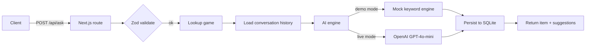

# Concepts overview

RulesGenie is a small app with a tight set of concepts. Once you have
these in your head the rest of the API and the codebase falls out
naturally.

## The four objects

| Object | What it is | Where it lives |
|---|---|---|
| **Game** | A board game in the catalog with metadata (name, complexity, mechanics, rulebook reference). | `src/data/games.ts` → seeded into `games` table |
| **Session** | A `(sessionId, gameId)` pair that scopes a conversation. Sessions are user-defined strings — typically a UUID per browser tab. | `qa_pairs` table |
| **Q&A pair** | A single question + answer + citations + confidence + mode, anchored to a session. | `qa_pairs` table |
| **Bookmark** | A flag on a Q&A pair, scoped to the dev `demo-user` persona. | `bookmarks` table |

## The request loop

Every meaningful interaction with RulesGenie boils down to:



The same shape applies to bookmarks, feedback, and collections — only
the verbs change.

## Demo vs. live mode

RulesGenie ships a deterministic mock engine so anyone can run the app
without an API key. The decision is made at request time:

```ts
const prefersDemo =
  process.env.RULESGENIE_DEMO_MODE !== 'false' || !process.env.OPENAI_API_KEY;
```

So:

- **No key set** → always demo
- **`RULESGENIE_DEMO_MODE=true`** → always demo (even if a key is set)
- **`RULESGENIE_DEMO_MODE=false` *and* a key is set** → live

The UI surfaces this via a **mode badge** on every answer. See
[Demo vs Live](/docs/concepts/demo-vs-live) for the full rules.

## Why citations matter

A board game ruling without a citation is just an opinion. Every answer
RulesGenie returns includes:

```ts
type Citation = {
  source: string;   // e.g. "Wingspan Rulebook"
  section: string;  // e.g. "Bonus Cards"
  page?: number;    // optional
};
```

If the engine cannot find a relevant citation, it lowers the confidence
to `low` and (in live mode) explicitly says “check the rulebook.” The
mock engine returns curated citations from `src/data/mock-qa.ts`.

## Why session memory matters

Players ask follow-ups. “What if there are three locomotives instead?”
only makes sense as a continuation of the previous turn.

RulesGenie loads the entire `qa_pairs` history for a `(sessionId, gameId)`
on every request and passes it to the engine. The mock engine ignores
history; the OpenAI engine uses it as conversation context.

→ Continue: [Architecture](/docs/concepts/architecture).
