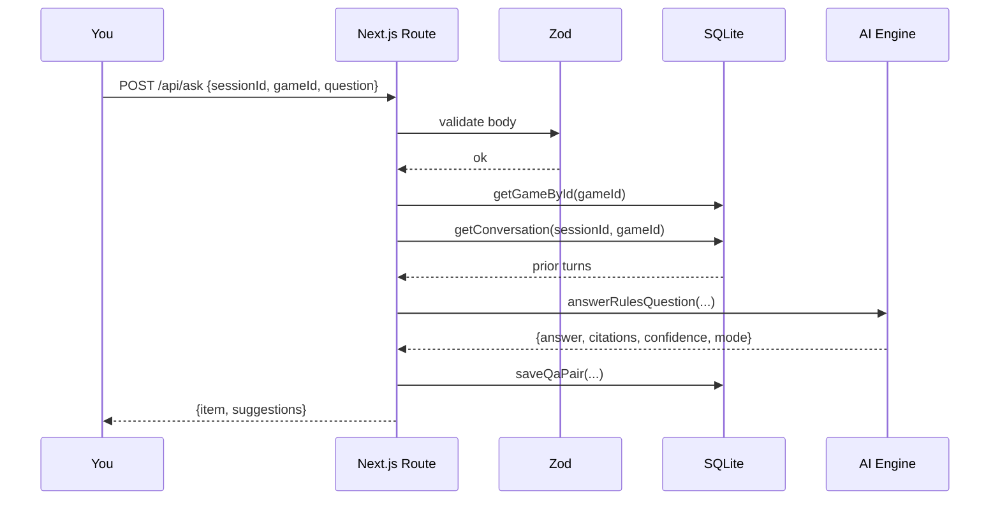

# Your first question

We'll ask the same question two ways: through the **Ask** page (the
normal user flow) and through the **REST API** (how integrations talk
to RulesGenie).

## Via the UI

1. Run `npm run dev`, open [http://localhost:3000](http://localhost:3000).
2. Click **Ask** in the header.
3. Select **Ticket to Ride** from the game picker.
4. Type your question:

   ```
   Can I draw a face-up locomotive first, then a regular train card?
   ```

5. Press **Enter** or click **Ask**.

In a moment you'll see something like this:

> **No.** Drawing a face-up locomotive uses your entire turn — you cannot
> then draw a second card. Locomotives are only “free” when you take them
> face-down from the deck.
>
> `✅ high confidence` · `📖 Ticket to Ride · Rulebook p. 4` · `⚡ demo`

Click the **bookmark icon** to save this answer to your dashboard. Type
a follow-up question — the AI engine sees the previous turn as part of
the session and answers in context.

## Via the API

The same loop, scripted.

### Step 1 — pick a session ID

Sessions are scoped per `(sessionId, gameId)` pair. Generate any string
you like (a UUID is a fine default):

```bash
SESSION_ID=$(uuidgen)
```

### Step 2 — ask

```bash
curl -s http://localhost:3000/api/ask \
  -H 'Content-Type: application/json' \
  -d "{
    \"sessionId\": \"$SESSION_ID\",
    \"gameId\": \"ticket-to-ride\",
    \"question\": \"Can I draw a face-up locomotive first?\"
  }" | jq .
```

You'll get back:

```json
{
  "item": {
    "id": "qa_2f9c...",
    "sessionId": "5b7a...",
    "gameId": "ticket-to-ride",
    "question": "Can I draw a face-up locomotive first?",
    "answer": "No. Drawing a face-up locomotive uses your entire turn...",
    "citations": [
      { "source": "Ticket to Ride Rulebook", "section": "Drawing Train Cards", "page": 4 }
    ],
    "confidence": "high",
    "status": "answered",
    "mode": "demo",
    "createdAt": "2025-01-15T18:23:11.045Z"
  },
  "suggestions": [
    "What happens if there are three locomotives in the face-up row?",
    "Can I claim a route on the same turn I draw cards?"
  ]
}
```

### Step 3 — follow up in the same session

The engine remembers the previous turn for this `(sessionId, gameId)`:

```bash
curl -s http://localhost:3000/api/ask \
  -H 'Content-Type: application/json' \
  -d "{
    \"sessionId\": \"$SESSION_ID\",
    \"gameId\": \"ticket-to-ride\",
    \"question\": \"What if I draw two non-locomotives instead?\"
  }" | jq .
```

### Step 4 — replay the conversation

```bash
curl -s "http://localhost:3000/api/session?sessionId=$SESSION_ID&gameId=ticket-to-ride" | jq .
```

That endpoint returns every Q&A pair from the session in order — perfect
for rebuilding a chat thread on a new client.

## What just happened



Everything is logged to SQLite so a refreshed browser tab — or a totally
different client — can pick the conversation up exactly where you left
off.

→ Next: [How sessions and citations work](/docs/concepts/sessions-and-citations).
