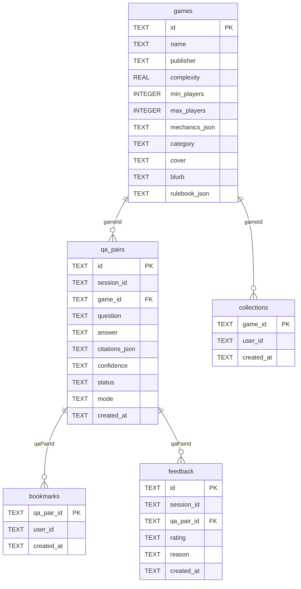

# Database schema

The full source of truth is `src/lib/db/schema.ts`. This page documents
the production-relevant subset.

## Diagram

## Tables

### `games`

The catalog. Seeded from `src/data/games.ts` on dev boot.

| Column | Type | Notes |
|---|---|---|
| `id` | TEXT PK | Stable slug, e.g. `ticket-to-ride`. |
| `name` | TEXT | Display name. |
| `publisher` | TEXT | |
| `designer` | TEXT | |
| `complexity` | REAL | 1.0 – 5.0 (BGG-style). |
| `min_players`, `max_players`, `best_players` | INTEGER | |
| `duration_min`, `duration_max` | INTEGER | Minutes. |
| `mechanics_json` | TEXT | JSON array of mechanic tags. |
| `category` | TEXT | gateway / euro / coop / party / heavyweight. |
| `cover` | TEXT | Path under `/public`. |
| `blurb` | TEXT | One-sentence pitch. |
| `rulebook_json` | TEXT | JSON `{ title, edition, url? }`. |

### `qa_pairs`

Every Q&A turn ever asked.

| Column | Type | Notes |
|---|---|---|
| `id` | TEXT PK | `qa_<random>`. |
| `session_id` | TEXT | Client-provided session identifier. |
| `game_id` | TEXT FK → `games.id` | Required, validated at the route. |
| `question` | TEXT | 3–500 chars. |
| `answer` | TEXT | From the AI engine. |
| `citations_json` | TEXT | JSON array of `Citation`. |
| `confidence` | TEXT | `high` / `medium` / `low`. |
| `status` | TEXT | `answered` / `needs-verification` / `unsupported`. |
| `mode` | TEXT | `demo` / `live`. |
| `created_at` | TEXT | ISO-8601. |

**Indexes**

- `(session_id, game_id)` — used by `getConversation`.
- `(created_at)` — used by dashboard recents.

### `bookmarks`

| Column | Type | Notes |
|---|---|---|
| `qa_pair_id` | TEXT PK → `qa_pairs.id` | One bookmark per Q&A pair (per user). |
| `user_id` | TEXT | Defaults to `demo-user` in dev. |
| `created_at` | TEXT | |

### `collections`

| Column | Type | Notes |
|---|---|---|
| `game_id` | TEXT PK → `games.id` | One row per game per user. |
| `user_id` | TEXT | |
| `created_at` | TEXT | |

### `feedback`

| Column | Type | Notes |
|---|---|---|
| `id` | TEXT PK | |
| `session_id` | TEXT | |
| `qa_pair_id` | TEXT FK → `qa_pairs.id` | |
| `rating` | TEXT | `up` / `down`. |
| `reason` | TEXT | Optional, ≤ 500 chars. |
| `created_at` | TEXT | |

## Notes

- All JSON-shaped columns are stored as TEXT and parsed in the data
  access layer. Use `JSON1` functions if you query directly via the
  `sqlite3` CLI.
- Foreign-key enforcement is enabled at connection time
  (`PRAGMA foreign_keys = ON;`).
- The schema migrations are idempotent — `CREATE TABLE IF NOT EXISTS` —
  so re-running the app against an existing DB is safe.
